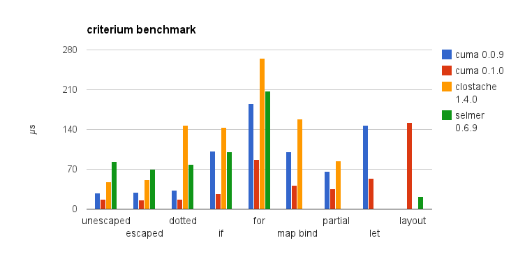

# cuma

Extensible micro template engine for Clojure.

[](https://travis-ci.org/liquidz/cuma)
[](https://www.versioneye.com/user/projects/52f62f2dec137564ea000204)

## Installation

Add following dependency to your `profject.clj`.

[](https://clojars.org/cuma)
## Usage

require `[cuma.core :refer [render]]`

### Replace Variable

```clojure
(render "hello $(x)" {:x "world"})
;=> hello world
```

Replace escaped variable.

```clojure
(render "$(x)" {:x "<h1>"})
;=> &lt;h1&gt;
```

Replace unescaped variable.

```clojure
(render "$(raw x)" {:x "<h1>"})
;=> <h1>
```

Include another template.

```clojure
(render "$(include tmpl)" {:tmpl "hello $(x)" :x "world"})
;=> hello world
```

Apply custom function to variable.
Function detail is explained at following.

```clojure
(render "$(upper x)" {:upper (fn [data s] (.toUpperCase s)) :x "hello")
;=> HELLO
```

Chain custom functions.

```clojure
(let [f (fn [_ arg] (str "foo " arg))
      g (fn [_ arg] (str "bar " arg))]
 (render "$(-> x g f)" {:f f :g g :x "baz"}))
;=> "foo bar baz"
```

### Replace Section
#### if section

```clojure
(render "@(if flg) foo @(end)" {:flg true})
;=> foo
(render "@(if flg) foo @(end)" {:flg false})
;=>
```

Implicit variable `$(.)` is binded in `if` section.

```clojure
(render "@(if x) $(.) @(end)" {:x "hello"})
;=> hello
```

Map data is expanded to variable in `if` section.

```clojure
(render "@(if m) $(n) @(end)" {:m {:n "foo"}})
;=> foo
```

#### for section

Implicit variable `$(.)` is binded in `for` section.

```clojure
(render "@(for arr) $(.) @(end)" {:arr [1 2 3]})
;=> 1 2 3
```

Map data is expanded to variable in `for` section.

```clojure
(render "@(for arr) $(n) @(end)" {:arr [{:n 1} {:n 2} {:n 3}]})
;=> 1 2 3

(render "@(for arr1) @(for arr2) $(a)$(b) @(end) @(end)"
        {:arr1 [{:a 1} {:a 2}] :arr2 [{:b 3} {:b 4}]})
;=> 13 14 23 24
```

#### let section

```clojure
(render "@(let :x \"foo\" :y 123) $(x) $(y) @(end)" {})
;=> foo 123
```

#### layout-file section

layout with implicit variable `.`

 * layout.tpl
```
hello $(.)
```
 * your code
```clojure
(render "@(layout-file \"layout.tpl\")world@(end)" {})
;=> helo world
```

layout with `block` section (`block` section can be used only in `layout-file` section)

 * layout.tpl
```
a = $(a), b = $(b)
```
 * your code
```clojure
(render "@(layout-file \"layout.pl\") @(block :a)hello@(end) @(block :b)world@(end) @(end)" {})
;=> a = hello, b = world
```

#### custom section
```clojure
(render "@(foo) world @(end)" {:foo (fn [data body] (str "hello " body))})
;=> hello world

(render "@(foo x) world @(end)"
        {:foo (fn [data body arg] (str arg " " body)) :x "hello"})
;=> hello world
```

### Dotted Variable

```clojure
(render "$(a.b.c)" {:a {:b {:c "hello"}}})
;=> hello
```

### Not Supporting Form
```clojure
; NOT SUPPORTED: nested variable
(render "$(f (g x))" {...})
```

## Writing Extension

Replacing variable and section are allowd to use custom function,
and cuma allows you to make custon function as extension.

Cuma searches `cuma.extension.*` namespaces, and load all public functions as extension.

`raw`, `->`, `include`, `if`, `for` are also extension.
https://github.com/liquidz/cuma/blob/master/src/cuma/extension/core.clj

### Variable Extension

```clojure
(render "$(f x y z)" {:x 1 :y 2 :z 3 :foo "bar"})
```

```clojure
(ns cuma.extension.YOUR_EXTENSION_NAME)

(defn f
  "@data => {:x 1 :y 2 :z 3 :foo "bar" :render #'cuma.core/render, OTHER_EXTENSIONS}
   @args => [1 2 3]"
  [data & args]
  (apply + args))
```

### Section Extension

```clojure
(render "@(f x y z) world @(end)" {:x 1 :y 2 :z 3 :foo "bar"})
```

```clojure
(ns cuma.extension.YOUR_EXTENSION_NAME)

(defn f
  "@data => {:x 1 :y 2 :z 3 :foo "bar" :render #'cuma.core/render, OTHER_EXTENSIONS}
   @body => " hello "
   @args => [1 2 3]"
  [data body & args]
  ((:render data) (str "hello" body)))
```

## Performance

Benchmarking is powered by [criterium](https://github.com/hugoduncan/criterium).
Test code is [here](https://github.com/liquidz/benchmark).




## License

Copyright (C) 2015 Masashi Iizuka([@uochan](http://twitter.com))

Distributed under the Eclipse Public License, the same as Clojure.
